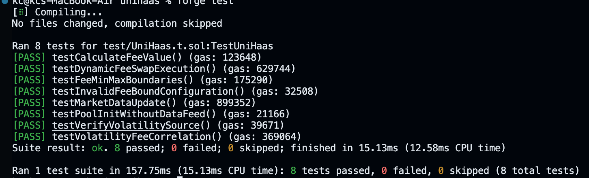

{width="300"}
# UniHaaS - Uniswap v4 Hook-as-a-Service

## Overview

**UniHaaS** (Uniswap Hook-as-a-Service) is a smart contract designed to provide dynamic fee adjustments based on market volatility using Chainlink price feeds. Built for **Uniswap v4**, it enables liquidity providers to benefit from more efficient and adaptive trading fees.

## Features

- **Dynamic Fees**: Adjusts swap fees based on short-term and long-term market volatility.
- **Chainlink Integration**: Uses Chainlink price feeds to fetch real-time volatility data.
- **Sigmoid Function**: Implements a flexible fee model using a sigmoid curve for smooth transitions.
- **Permissioned Hooks**: Implements Uniswap v4 hooks for before swap and initialization.
- **Modular & Expandable**: Can be extended to include impermanent loss protection, MEV resistance, and other advanced features.

## Current Status

Currently, we have implemented **Dynamic Fees**, and the rest of the functionalities will be added over time.

## How It Works

1. **Fetch Volatility Data**: The contract fetches short-term (24h) and long-term (7d) volatility data from Chainlink price feeds.
2. **Calculate Dynamic Fee**: Based on market trends, the contract applies a sigmoid function to determine the appropriate fee.
3. **Adjust Swap Fees**: The computed fee is dynamically set before each swap.
4. **Update Market Data**: Admins can update or remove volatility data feeds for different pools.

## Installation

### Prerequisites

- **Node.js & NPM**: Required for development and testing.
- **Foundry**: Recommended for Solidity development.
- **Uniswap v4 Core & Periphery**: Required dependencies.
- **Chainlink Contracts**: Needed for fetching market volatility data.

### Setup

```sh
# Clone the repository
git clone https://github.com/0xkaranchauhan/unihaas.git
cd unihaas

# Install dependencies
npm install
```

## Usage

### Get Dynamic Fee

```solidity
uint24 fee = uniHaaS.computeFee(poolId);
```

### Update Market Data

```solidity
uniHaaS.updateMarketData(poolKey, shortFeedAddress, longFeedAddress, precision);
```

### Remove Market Data

```solidity
uniHaaS.removeMarketData(poolKey);
```

## Hook Permissions

| Hook             | Status      |
| ---------------- | ----------- |
| beforeInitialize | ✅ Enabled  |
| afterInitialize  | ❌ Disabled |
| beforeSwap       | ✅ Enabled  |
| afterSwap        | ❌ Disabled |

## Future Improvements

- **Impermanent Loss Protection**
- **MEV Protection**
- **Auto-Rebalancing Pools**
- **Cross-Chain Liquidity Integration**



## Contributors

- **Karan Singh Chauhan (karanchauhan.eth)** (Lead Developer)
- Open for contributions! Feel free to submit PRs.

## Contact

For inquiries, reach out via [Twitter](https://x.com/0xkaranchauhan) or [GitHub Issues](https://github.com/0xkaranchauhan/unihaas/issues).
